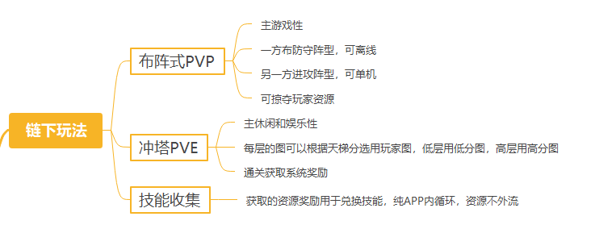

# 链下玩法

链游设计中，中心化开发与去中心化资产所有权之间，存在着内在张力。核心矛盾在于，中心化团队的任何游戏平衡性调整、新内容发布或经济参数修改，都可能直接影响去中心化资产的价值，从而引发玩家（作为资产持有者）与开发商之间的冲突，甚至动摇玩家对“真正所有权”的信任。

## Hun 游戏设计

然而，天下没有绝对的完美，游戏设计中的平衡性调整难以避免。那么，游戏平衡性和资产稳定性，有什么办法可以两全其美呢？

Hun 采取了链上 / 链下分离的设计：

- 链上侧重于养成和收藏，不引入任何有关游戏平衡性的内容，基因、品质、特性、皮肤、神秘标记等，都只影响外观；
- 链下侧重于游戏性，链下游戏可根据自身玩法独立设计任意技能，包括技能特效和数值等；
- 链上 Hun 仅作为链下游戏技能的“插槽”，相互之间不绑定，而是通过属性类别区分可“插入”的“技能书”；
- Hun 的部位品质越高，可“插入”的技能越强，种类越多。

> 💡 分离设计，使任何人都可以使用 Huns 开发自己的游戏，设计自己的技能。

## 链下玩法 A （规划中）

想做个类似《海岛奇兵》那种“离线PVP休闲模式”的“单机休闲网游”，随时拿起手机，只需要自己上线，三五分钟玩一把。由于对手都是真实玩家，不至于太无聊。也可以搞个爬塔冲层的 PVE 玩法，把玩家社区时防守天梯榜上难度高的图拿来当守关 BOSS；

